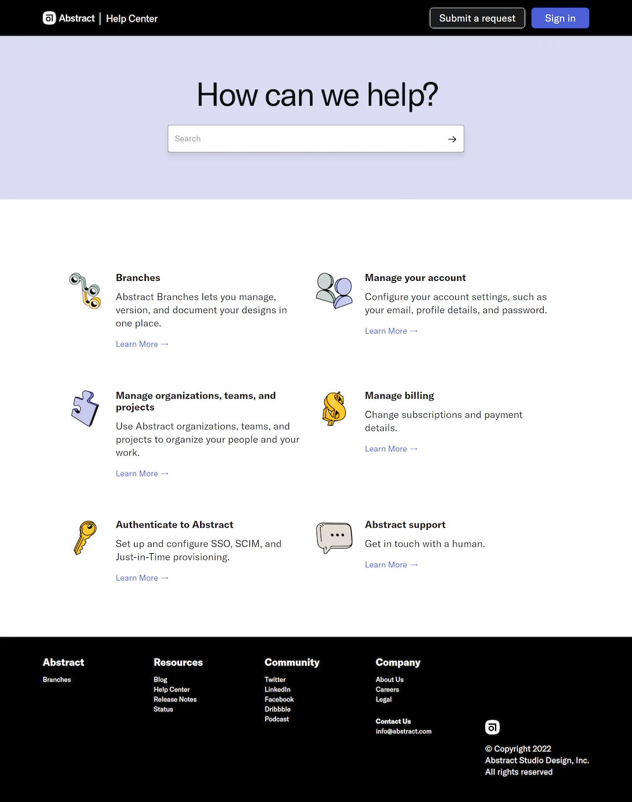

# Frontend Practice- Abstract

Here is my code for Frontend Practise web challenge.

## Info

I like to make my project fully responsive by using @media query and relative units. Inside CSS file I used custom properties to easier future modification, CSS Reset code to remove default settings of selectors properties and I also used some pseudo-class.
